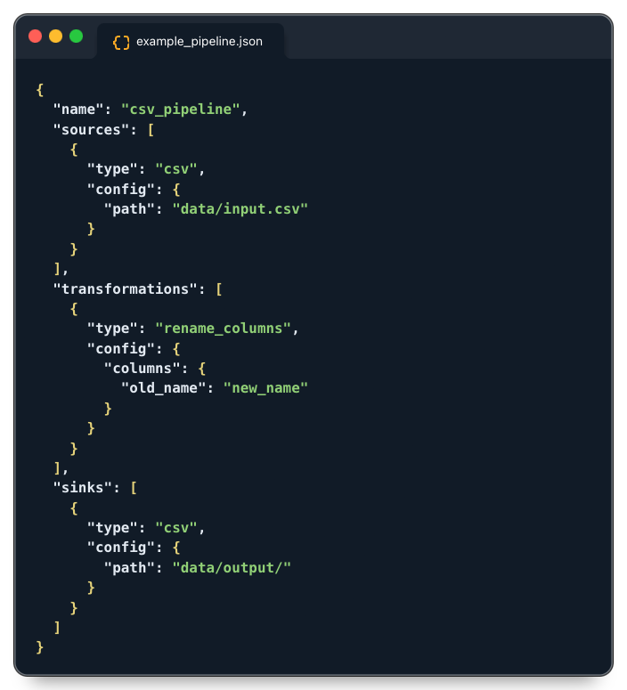

# RapidETL 🚀

**RapidETL** is a **lightweight, low-code Python library** for building blazing-fast ETL (Extract, Transform, Load) pipelines using **simple JSON configurations**. Designed for **speed and simplicity**, RapidETL eliminates boilerplate code and enables rapid prototyping, making it ideal for small to medium-scale data workflows.

---

## Features ✨

- **Declarative Pipelines**: Define ETL pipelines in **JSON**—no Python or SQL required.
- **Blazing Fast**: Built on **Polars** (Rust-powered DataFrames) for high-performance data processing.
- **Extensible Connectors**: Prebuilt connectors for **CSV, APIs, BigQuery, S3**, and more.
- **Low-Code Transformations**: Apply common transformations (e.g., renaming, filtering, type casting) with minimal configuration.
- **Custom Python Hooks**: Extend functionality with custom Python scripts for advanced use cases.
- **Built-in Scheduling**: Run pipelines on cron-like schedules or event triggers.
- **Lightweight**: No heavy infrastructure required—runs locally or in the cloud.
- **Validation**: Automatic schema validation using **Pydantic**.
- **Open Source**: Free, open-source, and community-driven.

---

## Quick Start 🚀

### Installation

    pip install rapidetl

### Example Pipeline

Create a  `exampe_pipeline.json`  file:

